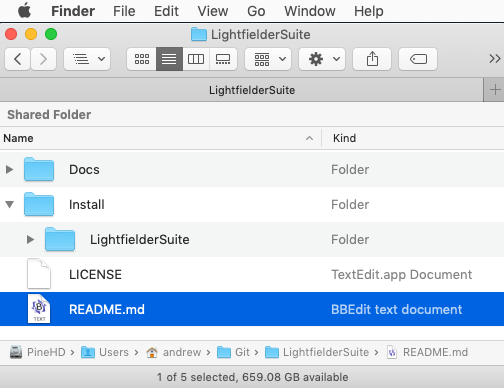
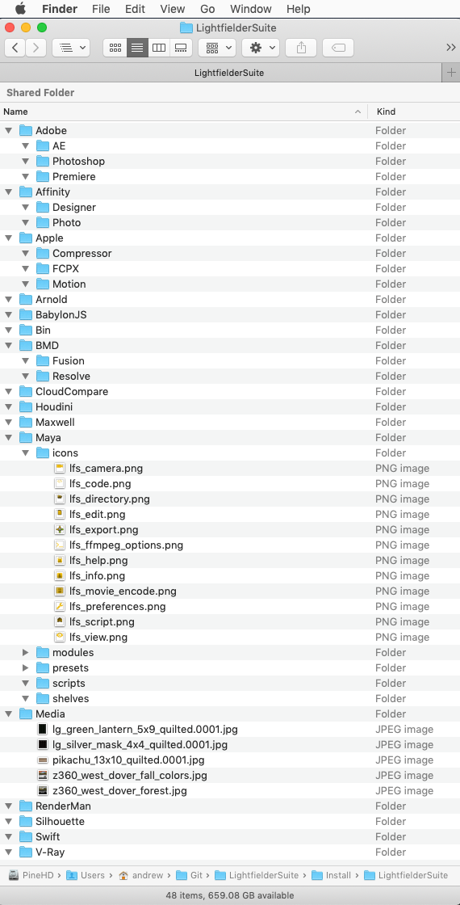
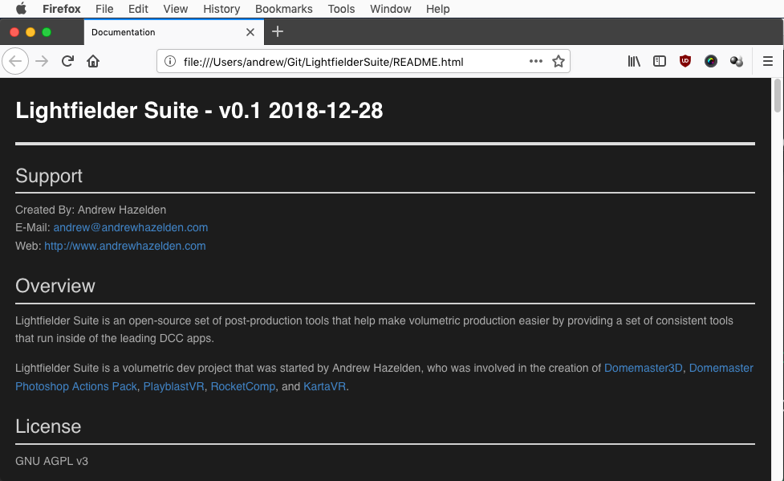
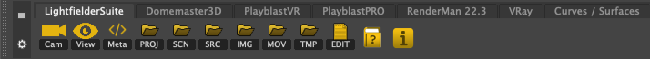
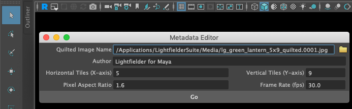
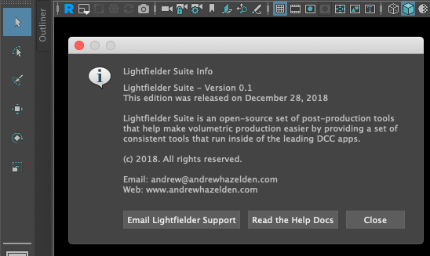
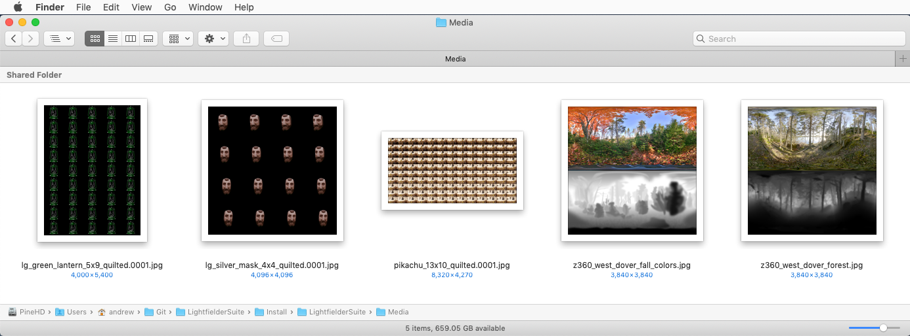

# Lightfielder Suite - v0.1 2018-12-28 #

---

## Support ##

Created By: Andrew Hazelden  
E-Mail: [andrew@andrewhazelden.com](mailto:andrew@andrewhazelden.com)  
Web: [http://www.andrewhazelden.com](http://www.andrewhazelden.com)  

## Overview ##

Lightfielder Suite is an open-source set of post-production tools that help make volumetric production easier by providing a set of consistent tools that run inside of the leading DCC apps.

Lightfielder Suite is a volumetric dev project that was started by Andrew Hazelden, who was involved in the creation of [Domemaster3D](https://github.com/zicher3d-org/domemaster-stereo-shader), [Domemaster Photoshop Actions Pack](https://github.com/AndrewHazelden/Domemaster-Photoshop-Actions-Pack), [PlayblastVR](http://www.cgchannel.com/2016/07/andrew-hazelden-releases-playblastvr-for-maya-v2-0/), [RocketComp](http://www.cgchannel.com/2015/07/andrew-hazelden-releases-rocketcomp-for-maya/), and [KartaVR](http://www.andrewhazelden.com/projects/kartavr/docs/).

## License ##

GNU AGPL v3

## Table of Contents ##

- [Support](#support)
- [Overview](#overview)
- [License](#license)
- [Table of Contents](#toc)
- [Install](#install)
- [Screenshots](#screenshots)
- [Media](#media)
- [Supported Tools](#supported-tools)
- [Version History](#version-history)

## Install ##

Lightfielder Suite is installed on Mac/Win/Linux system by copying the "Install" folder contents over to:

- `/Applications/LightfielderSuite` (macOS)
- `/opt/LightfielderSuite/` (Linux)
- `C:/Program Files/LightfielderSuite/` (Windows)

This image shows the base folder hierarchy of the git repo:

The `Install/LightfielderSuite/` folder holds the files for each of the supported DCC app integrations:

Open the Lightfielder Suite's included `Readme.md` or `Readme.html` guide for a summary of how the toolset is installed and used.

## Screenshots ##

### Maya ###

Lightfielder Suite for Maya comes with a custom shelf:

The `Meta` button in the shelf opens up a "Metadata Editor" window:

The `Info` button in the shelf opens up a "Lightfielder Suite info" window that provides a summary of the version number and release date:

## Media ##

A collection of sample volumetric media assets are included with Lightfielder Suite at: `LightfielderSuite/Media`

Media Assets:

- lg_green_lantern_5x9_quilted.0001.jpg  
- lg_silver_mask_4x4_quilted.0001.jpg  
- pikachu_13x10_quilted.0001.jpg  
- z360_west_dover_forest.jpg  
- z360_west_dover_fall_colors.jpg  

## Supported Tools ##

- Adobe
	- AE
	- Illustrator
	- Photoshop
	- Premiere
- Affinity
	- Designer
	- Photo
- Apple
	- Compressor
	- FCPX
	- Motion
- Arnold
- BabylonJS
- Bin
	- curl
	- cmark
	- cygwin
	- djv_view
	- exiftool
	- ffmpeg
	- fonts
	- imagemagick
	- cloudcompare
	- meshlab
	- lua
	- panotools
	- python
	- vlc
	- wintee
- BMD
	- Fusion
	- Resolve
- CloudCompare
- Houdini
- Maxwell
- Maya
- RenderMan
- Silhouette
- Swift
- V-Ray

## Version History ##

### v0.1 - 2018-12-28 ###

Initial Commit
